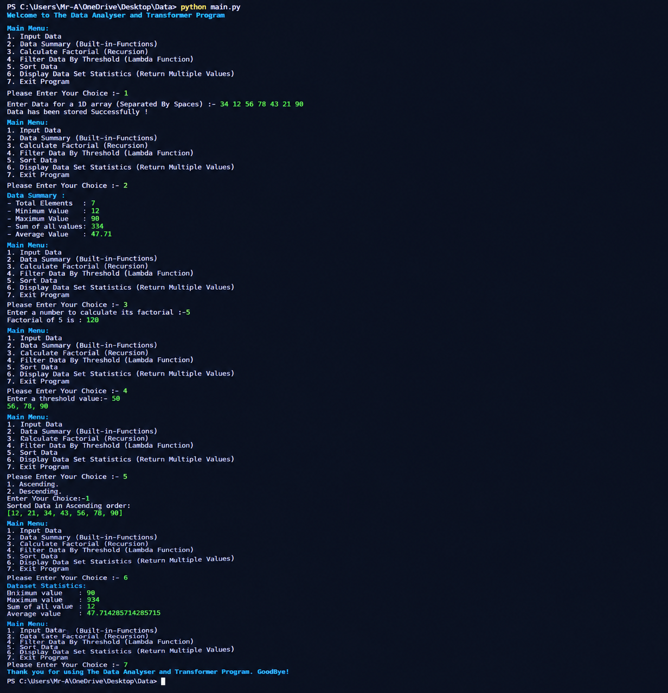

# Data Analyzer and Transformer Program

## 📌 Project Description

The **Data Analyzer and Transformer Program** is a Python-based console application designed to perform different operations on **1D and 2D array data**.

This project demonstrates important Python programming concepts such as functions, loops, conditional statements, recursion, lambda functions, filtering, sorting, built-in functions, and returning multiple values from functions.

The project was developed to strengthen Python programming fundamentals and apply them in a practical data-processing application.

---

## 🚀 Features

- Input and store **1D Array** data
- Input and store **2D Array** data
- Display Data Summary
- Calculate minimum value
- Calculate maximum value
- Calculate sum of values
- Calculate average value
- Calculate factorial using **Recursion**
- Filter data using **Lambda Function**
- Sort data in:
  - Ascending order
  - Descending order
- Display dataset statistics
- Menu-driven console interface

---

## 🛠️ Technologies Used

- **Python 3**
- Lists
- Loops
- Functions
- Conditional Statements
- Recursion
- Lambda Functions
- Filter Function
- Built-in Functions
- Multiple Return Values
- 1D and 2D Arrays

---

## 📂 Project Structure

```text

│
├── README.md
├── image.png
└── main.py
````

---

## ⚙️ Installation

### Step 1: Install Python

Make sure Python 3 is installed on your computer.

Check Python version:

```bash
python --version
```

### Step 2: Clone the Repository

```bash
git clone <your-repository-link>
```

### Step 3: Open the Project Folder

```bash
cd Data-Analyzer-and-Transformer-Program
```

### Step 4: Run the Program

```bash
python main.py
```

---

## ▶️ How to Use

After running the program, the main menu will appear:

```text
Main Menu:
1. Input Data
2. Data Summary (Built-in-Functions)
3. Calculate Factorial (Recursion)
4. Filter Data By Threshold (Lambda Function)
5. Sort Data
6. Display Data Set Statistics (Return Multiple Values)
7. Exit Program
```

---

## 📊 Example

### Step 1: Input 1D Data

```text
1. 1D Array
2. 2D Array

Enter your Choice: 1

Enter Data for a 1D array (Separated By Spaces):
12 34 56 67 98 23 54 78 37 74 77
```

### Step 2: Data Summary

```text
Data Summary:
- Total Elements   : 11
- Minimum Value    : 12
- Maximum Value    : 98
- Sum of all values: 610
- Average Value    : 55.45
```

### Step 3: Calculate Factorial

```text
Enter a number to calculate its factorial: 9

Factorial of 9 is: 362880
```

### Step 4: Filter Data

```text
Enter a threshold value: 50

56, 67, 98, 54, 78, 74, 77
```

### Step 5: Sort Data

```text
Sorted Data in Ascending order:

[12, 23, 34, 37, 54, 56, 67, 74, 77, 78, 98]
```

### Step 6: Dataset Statistics

```text
Dataset Statistics:
- Minimum Value  : 12
- Maximum Value  : 98
- Sum of all values: 610
- Average Value  : 55.45
```

---

## 🔢 2D Array Example

The program also supports 2D arrays.

Example:

```text
1. 1D Array
2. 2D Array

Enter your Choice: 2

Enter Number of Rows: 2
Enter Number of Columns: 3

Enter Number Value: 10
Enter Number Value: 20
Enter Number Value: 30

Enter Number Value: 40
Enter Number Value: 50
Enter Number Value: 60
```

The stored 2D data will be:

```text
[[10, 20, 30],
 [40, 50, 60]]
```

The program can perform summary, filtering, sorting, and statistics operations on the 2D data.

---

## 🖼️ Program Output



---

## 🎯 Learning Objectives

Through this project, I practiced:

* Python fundamentals
* Working with 1D and 2D arrays
* Nested loops
* Functions
* Recursion
* Lambda functions
* Data filtering
* Data sorting
* Built-in Python functions
* Multiple return values
* Menu-driven programming
* Problem-solving skills

---


## 👨‍💻 Author

**Virendra Nakum**
 
